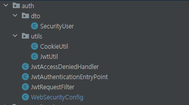

# 토큰 인증 방식 적용 
> 지식플랫폼의 웹접속 인증과 권한적용은 스프링 시큐리티와 json 웹토큰 인증방식을 적용했습니다. 주의할 점은 스프링시큐리티를 디펜던시에 적용하는 순간 인증을 거치지 않은 서비스는 호출되지 않게 된다는 것입니다. 지식 그래프의 서비스 구조에 맞춰 적용 방안을 고려해야 합니다.

> 전반적인 json웹토큰 인증 개념은 저도 이곳을 참조했습니다. [참조 페이지](https://velog.io/@ehdrms2034/Spring-Security-JWT-Redis%EB%A5%BC-%ED%86%B5%ED%95%9C-%ED%9A%8C%EC%9B%90%EC%9D%B8%EC%A6%9D%ED%97%88%EA%B0%80-%EA%B5%AC%ED%98%84)


1. 메이븐 디펜던시 설정
- 스프링 시큐리티와 json 웹토큰 관련 설정이 필요합니다. 지식플랫폼에서는 스프링 부트 기반 시큐리티를 적용했기 때문에 전자 정부 프레임워크는 스프링 시큐리티 디펜던시를 변경해야합니다. json 웹토큰 관련 부분은 그대로 사용하셔도 될 것입니다.
```
<!-- 스프링 부트의 시큐리티 디펜던시  -->
<dependency>
    <groupId>org.springframework.boot</groupId>
    <artifactId>spring-boot-starter-security</artifactId>
</dependency>

<!-- 이하 json 웹토큰 디펜던시  -->
<dependency>
    <groupId>io.jsonwebtoken</groupId>
    <artifactId>jjwt-api</artifactId>
    <version>0.11.1</version>
</dependency>
<dependency>
    <groupId>io.jsonwebtoken</groupId>
    <artifactId>jjwt-impl</artifactId>
    <version>0.11.1</version>
    <scope>runtime</scope>
</dependency>
<dependency>
    <groupId>io.jsonwebtoken</groupId>
    <artifactId>jjwt-jackson</artifactId> <!-- or jjwt-gson if Gson is preferred -->
    <version>0.11.1</version>
    <scope>runtime</scope>
</dependency>
<dependency>
    <groupId>org.springframework.security</groupId>
    <artifactId>spring-security-jwt</artifactId>
    <version>1.1.1.RELEASE</version>
</dependency>
```
2. 인증 관련 클래스 패키지 : 업로드한 Java 파일에 조금 더 상세한 내역이 주석처리되어있습니다.


- WebSecurityConfig : 웹 시큐리티 룰을 정의한 클래스입니다.
- JwtRequestFilter : 스프링필터 구현 클래스로 인증토큰 발급 여부를 체크하고 인증토큰이 존재하면 인증토큰의 정보를 처리합니다.
- JwtAuthenticationEntryPoint : 인증되지 않은 사용자가 서비스를 호출한 경우 메시지를 처리합니다.
- JwtAccessDeniedHandler : 인증된 사용자가 권한에 맞지 않은 서비스를 호출한 경우 메시지를 처리합니다.
- dto 패키지
1) SecurityUser : 서버 내부에서 사용자 정보를 이용하는 경우 사용자 정보를 담고있는 클래스입니다.
- utils 패키지
1) JwtUtil : json웹토큰을 생성하고 검증하는 클래스입니다.
2) CookieUtil : json웹토큰이 생성되면 쿠키에 담겨서 브라우저에 전달되는데 쿠키를 생성하는 클래스입니다.

3. 회원가입, 로그인, 로그아웃, 인증토큰 발행 처리 : 업로드한 Java 파일에 조금 더 상세한 내역이 주석처리되어있습니다.
- AccountController : 지식플랫폼 웹 시스템의 인증관련 진입 클래스입니다. 
- AccountServiceImpl : 회원 가입과 로그인 처리 서비스 레이어 클래스입니다.
